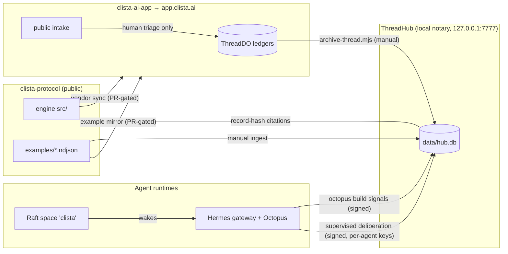

# ClisTa Atlas

The integration map for the ClisTa ecosystem — every repo, service, agent,
identity, and data flow, in one place. **Private.** This is the answer to
"what talks to what, as whom, with which key."

> Maintenance rule: any session that changes an integration (new writer, new
> identity, new flow, a retirement) updates the atlas in the same PR/commit
> as the change. A stale map is worse than no map.

## The one-paragraph version

**clista-protocol** defines and validates the event grammar. **clista-ai-app**
(app.clista.ai) is the live human cockpit over that grammar. **ThreadHub** is
the notary — a signed, hash-chained, content-addressed archive where decisions
get permanent citation addresses. **Hermes** (with the **Octopus** plugin) is
the local agent runtime; **Raft** (app.raft.build) is where the agent team
coordinates. Logs move between systems as ClisTa events — by reviewed vendor
sync, by manual ingest, or by per-agent signed writes. Nothing moves
automatically into a production ledger.

## Map

## Pages

| Page | Answers |
|---|---|
| [architecture.md](docs/architecture.md) | The systems and every data flow between them |
| [identities.md](docs/identities.md) | Who can write where, as whom, with which key — the full credential inventory |
| [operations.md](docs/operations.md) | Runbook: services, deploys, tests, the archive command |
| [decisions.md](docs/decisions.md) | The governing decisions and where their permanent records live |
| [history.md](docs/history.md) | Timeline: milestones, incidents, retirements |

## Standing invariants (the rules everything above obeys)

1. **Semantic author = transport writer.** An agent writes only as itself,
   with its own key. No shared keys, no harvest-appending others' content
   under your identity. (Learned the hard way: 2026-07-04 incident.)
2. **Agents contribute, humans decide.** No agent emits `DecisionMerged` or
   `DecisionRequestOpened` anywhere.
3. **Supervised only.** No scheduled/cron agent writers exist. Re-introducing
   one is itself an open decision (`agent-loop-autonomy`) and requires a
   tested STOP control that survives gateway updates.
4. **ThreadHub stays loopback-only** until a decision says otherwise — it has
   no auth beyond a write rate limit.
5. **Production ledgers are append-only.** Nothing is deleted or corrected in
   place; mistakes are contained and superseded by new records.
